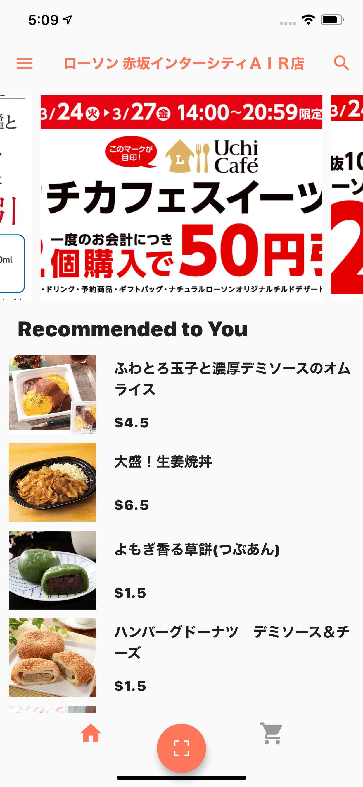
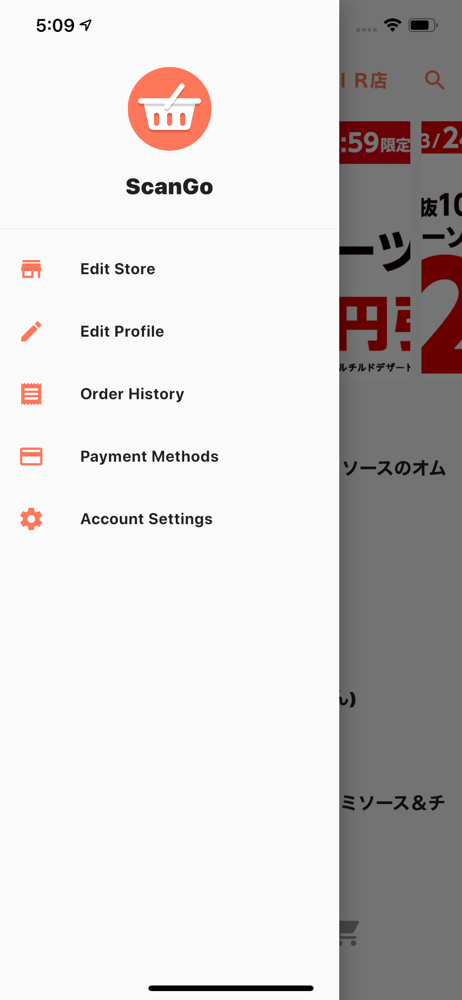
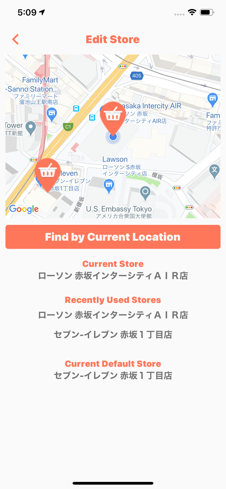
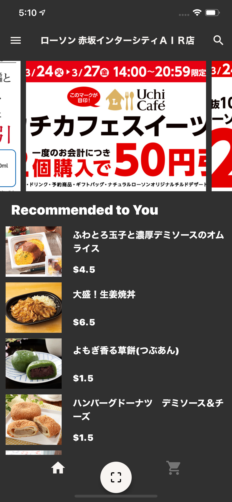
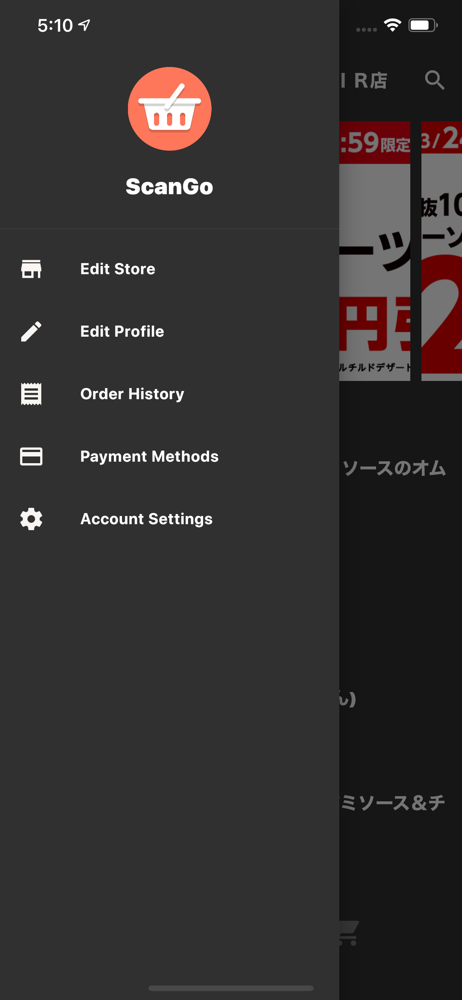
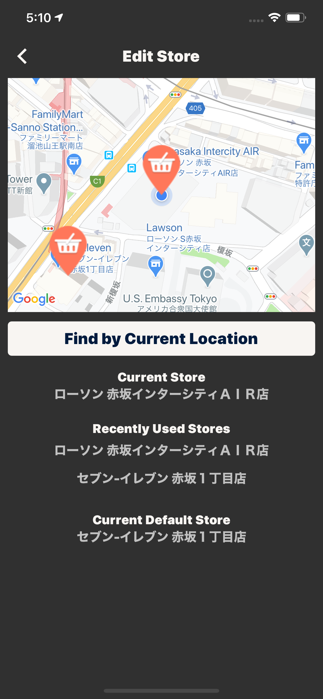

  

    
    <h1 align="center" style="font-size: 48px; font-weight: bold;">ScanGo</h1>
  

  <h2 align="center">self-checkout shopping app build with Flutter & Firebase
  </h2>

  

    
  

---

## Screens

  

    
    
    
  

  

    
    
    
  

## Main Features

- Scan barcode and find the product
- Automatically detect store based on current location
- Authentication with email, Google, and Apple
- Light Theme & Dark Theme
- Localization(only Japanese)

## Main Stack

- Flutter
- Provider as State Management
- Firbase Auth for Authentication
- Firestore for persistent data

### About

This is a small personal project. Any comments and reactions would be awesome! Please check
[other projects](https://github.com/ykaito21/flutter_projects/blob/master/project_list.md) too.
